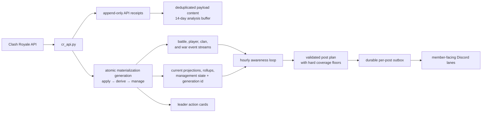

# Elixir Bot

Elixir is the clan agent for the POAP KINGS Clash Royale clan (`#J2RGCRVG`).
It combines a deterministic data engine, an LLM awareness loop, scoped memory,
Discord conversation, and leadership workflows.

[AGENTS.md](AGENTS.md) is the source of truth for architecture and repository
conventions. [SETUP.md](SETUP.md) is the production operations guide.

## System at a glance

Elixir has one external data ingress and one proactive voice:



- `cr_api.py` is the only Clash Royale API ingress. Every successful response
  appends an `api_observation_receipts` row; identical bodies share one
  `raw_api_payloads` content row.
- `engine.tick.run_tick` records the admitted inputs and commits streams,
  projections, rollups, readiness, management, and generation status together.
  Interactive profile/battle-log refreshes use the same generation contract.
- Event streams are durable history. Projections are disposable read models.
  Current state is never reconstructed from prompts.
- The awareness loop reads one SQLite snapshot identified by `data_generation`,
  decides what is worth saying, and is the sole proactive poster. Its whole plan
  is validated and persisted before send; partial retries skip fulfilled posts.
- Clan management is deterministic. It writes state and leader actions; it does
  not delegate promotion, demotion, or kick policy to the model.

The detailed v5.1 design is in [docs/reference/v5.1/](docs/reference/v5.1/).

## Product surfaces

Elixir speaks as one identity across destination-specific Discord lanes:

- `#elixir` — the awareness brain's curated public commentary and updates.
- `#announcements` — weekly recaps and major system updates.
- `#actions` — crisp leadership handoff cards and action outcomes.
- `#ask-elixir` — open member conversation and screenshot help.
- `#clan-chat` — mention-driven clan help.
- `#leaders` — private, evidence-grounded clan operations.
- `#welcome` — onboarding and identity verification.
- `#recruiting` — reusable recruiting copy.

The exact channel IDs, reply policies, memory scopes, and workflows live in
[prompts/DISCORD.md](prompts/DISCORD.md).

## Recurring activities

[runtime/activities.py](runtime/activities.py) is the canonical registry for
activity keys, ownership, schedules, executors, delivery targets, and enabled
state. The important groups are:

- Core: `engine-tick` and `awareness-loop`.
- Clan management: `weekly-leadership-review`,
  `action-outcome-refresh`, and `war-attendance-snapshot`.
- Member communications: `daily-clan-insight`, `weekly-recap`,
  `weekly-member-report`, `weekly-elder-standing`, `promotion-content`, and
  `weekly-discord-invite-relay`.
- Data and operations: `card-catalog-sync`, `api-sentinel`, `db-maintenance`,
  `db-backup`, and `memory-synthesis`.
- Optional/manual: `clan-wars-intel`; tournament watching is dynamically
  started and resumed outside the recurring registry.

Do not duplicate schedule values in prose; inspect the registry or use the
`/clanops activity ...` commands.

## Quick start

Python 3.14 is the supported runtime.

```bash
uv sync --locked
# Create .env with the required secrets below.
uv run --locked python elixir.py
```

Required secrets:

```env
DISCORD_TOKEN=...
CLAUDE_API_KEY=...
CR_API_KEY=...
```

Non-secret clan and Discord configuration lives in `prompts/CLAN.md` and
`prompts/DISCORD.md`. See [SETUP.md](SETUP.md) before running production.

`pyproject.toml` contains direct runtime and development constraints.
`uv.lock` is the exact environment used by CI and deployment.

## Repository map

- [elixir.py](elixir.py) — process entrypoint.
- [elixir_agent.py](elixir_agent.py) — stable public LLM facade.
- [cr_api.py](cr_api.py) — sole Clash Royale API ingress.
- [engine/](engine/) — five-step data engine, emitters, projections,
  management, polling, and offline rehearsal.
- [db/](db/) — canonical schema builder and migrations, connection discipline,
  schema checks, and storage facade.
- [storage/](storage/) — domain persistence and read helpers.
- [agent/](agent/) — workflow prompts, model loop, tool contracts, and tools.
- [runtime/](runtime/) — Discord routing, activities, jobs, awareness, logging,
  and the Observatory web app.
- [prompts/](prompts/) — identity, purpose, clan, channel, lane, and workflow
  instructions.
- [tests/](tests/) — unit, integration, fixture, invariant, and entrypoint tests.

## Database model

The operational database defaults to `elixir-v51.db`. Clash Royale player tags
are natural keys everywhere. The pre-cut database is the immutable cold archive
`elixir-v5-archive-2026H2.db` and must never be written.

The runtime data layers are:

1. Raw API responses — bounded analysis buffer, not system of record.
2. Baselines — current comparison substrate for state-diff emitters.
3. Event streams — durable battle/player/clan/war facts.
4. Rollups — durable player and clan daily metrics.
5. Identity and tenure — players, Discord links, aliases, and memberships.
6. Projections — rebuildable current state and management views.
7. Awareness, management, operations, and scoped memory records.

See [docs/data-model-erd.md](docs/data-model-erd.md) and
[docs/reference/v5.1/schema.md](docs/reference/v5.1/schema.md).

## Tests and confidence gates

Use the locked uv environment:

```bash
uv lock --check
uv run --locked python scripts/check_docs.py
uv run --locked python scripts/check_exception_hygiene.py
uv run --locked ruff check .
uv run --locked ruff format --check .
uv run --locked mypy capabilities/contracts.py
uv run --locked pytest tests/ -q --cov=capabilities --cov-report=term-missing --cov-fail-under=80
```

Before deploying engine changes, also run:

```bash
uv run --locked python scripts/replay_gate.py
uv run --locked python scripts/simulate.py
```

For one consolidated health answer:

```bash
uv run --locked python scripts/confidence_report.py --json
```

The suite uses isolated SQLite databases and mocked external services. Real CR
payload shapes live in `tests/fixtures/cr/`; refresh them from retained raw
payloads rather than hand-editing them.

## Operations

Production is managed by `launchd` through `scripts/admin.sh`:

```bash
bash scripts/admin.sh status
bash scripts/admin.sh restart
bash scripts/admin.sh activity run api-sentinel
```

Elixir does not monitor itself: `logs/elixir-error.log` (ERROR+ with tracebacks)
is the operator interface, and triaging it is the Operations Manager's job — see
`AGENT-TEAM/error-watch.md`.

Member self-service commands live under `/elixir`. Leadership operations live
under `/clanops`. System telemetry and management surfaces belong in the
Observatory web app, not general Discord commands.

Review model/channel failures with:

```bash
uv run --locked python scripts/review_agent_feedback.py --limit 20
uv run --locked python scripts/review_agent_feedback.py --workflow clanops --json
```

## Cleanup and portability

```bash
uv run --locked python scripts/clean.py
uv run --locked python scripts/clean.py --db
```

The database cleanup option removes only legacy local runtime files; it never
touches `elixir-v51.db` or the archives.

A new clan primarily rewrites `prompts/CLAN.md`, `prompts/DISCORD.md`, and any
culture-specific lane prompts. Elixir no longer publishes poapkings.com; the
site has its own standalone update process.

## Fan Content and Attribution

Elixir is an unofficial, non-commercial fan project. It is not affiliated with,
authorized, or endorsed by Supercell. Clash Royale and the Clash Royale API are
trademarks of Supercell, and the card names, card/badge artwork, and game data
Elixir reads and displays are Supercell's intellectual property, used under
Supercell's [Fan Content Policy](https://www.supercell.com/fan-content-policy).
Card and badge imagery posted to Discord is served live from Supercell's own CDN
(`api-assets.clashroyale.com`); this project does not redistribute or bundle it.
See [`LICENSE`](LICENSE) for the third-party carve-out.

> This material is unofficial and is not endorsed by Supercell. For more
> information see Supercell's Fan Content Policy: www.supercell.com/fan-content-policy.
