# Data Model ERD

Logical map of Elixir's v5.1 operational database. The executable baseline is
[`scripts/migrate_v51/schema_v51.py`](../scripts/migrate_v51/schema_v51.py);
bounded post-cut additions live in [`db/schema.py`](../db/schema.py). This page
shows ownership and flow rather than every column.

```mermaid
erDiagram
    clans ||--o{ clan_memberships : contains
    players ||--o{ clan_memberships : has_tenure
    players ||--o{ player_aliases : has
    players ||--o{ discord_links : linked_to
    discord_users ||--o{ discord_links : verifies

    raw_api_payloads ||--o{ state_baselines : informs
    raw_api_payloads ||--o{ battle_events : mirrors
    state_baselines ||--o{ player_events : diffs_to
    state_baselines ||--o{ clan_events : diffs_to
    state_baselines ||--o{ war_events : diffs_to

    players ||--o{ battle_events : participates
    players ||--o{ player_events : changes
    clans ||--o{ clan_events : changes
    clans ||--o{ war_events : races

    battle_events ||--o{ player_daily_battle_rollups : rolls_up
    player_events ||--o{ player_daily_metrics : rolls_up
    clan_events ||--o{ clan_daily_metrics : rolls_up

    players ||--o| player_current_state : projects
    players ||--o| player_recent_form : projects
    players ||--o| member_management : evaluates
    materialization_runs ||--o{ member_management : qualifies
    players ||--o{ leader_action_recommendations : concerns

    war_seasons ||--o{ war_weeks : contains
    war_weeks ||--o{ war_week_clans : includes
    war_weeks ||--o{ war_participation : records
    players ||--o{ war_participation : participates
    war_seasons ||--o{ awards : grants
    players ||--o{ awards : receives

    awareness_thoughts ||--o{ awareness_posts : plans
    conversation_threads ||--o{ messages : contains
    memories ||--o{ memory_tags : classified_by
```

## Layer ownership

| Layer | Representative tables | Contract |
|---|---|---|
| API buffer | `raw_api_payloads` | Append-only raw responses, retained for 14 days; never the system of record. |
| Diff substrate | `state_baselines` | Latest normalized comparison state; first sight emits no change event. |
| Streams | `battle_events`, `player_events`, `clan_events`, `war_events` | Durable typed facts with deterministic dedup keys. |
| Rollups | `player_daily_metrics`, `player_daily_battle_rollups`, `clan_daily_metrics` | Durable Chicago-day aggregates. (`clan_daily_battle_rollups` dropped in #211 — its writer had lost its caller and the live trend path reads `battle_events`.) |
| Identity and tenure | `players`, `clans`, `clan_memberships`, `player_aliases`, `discord_users`, `discord_links` | Clash Royale tag is the natural player key; membership is an open tenure row. |
| Projections | `player_current_state`, `player_card_collection`, `player_recent_form`, `member_management` | Rebuildable query models, not primary history. |
| War and awards | `war_seasons`, `war_weeks`, `war_week_clans`, `war_participation`, `war_attendance_days`, `awards` | Bounded war truth plus durable honors. |
| Awareness and leadership | `awareness_thoughts`, `awareness_posts`, `leader_action_recommendations`, `revisits` | Deliberation, confirmed delivery, and policy outcomes. Standing concerns live in `memories` as `Watch:` / `Hold:` titles; the `watches` table was never written and was dropped in #211. The legacy `decision_cases` table and leader-action link were removed in schema v21 (#216). |
| Conversation and memory | `conversation_threads`, `messages`, `memories`, `memory_tags`, `memories_fts` | Channel-scoped conversation and public/leadership durable memory. (`memory_log` dropped in #215 — an audit trail with no reader.) |
| Runtime control | `stream_cursors`, `poll_state`, `materialization_runs`, `runtime_job_status` | Progress, adaptive polling, data-product readiness/provenance, and job health. (`runtime_incidents` dropped in V20 — it recorded 0 rows in 25 days while the error log held 159; failure visibility is `logs/elixir-error.log`.) |

## Invariants

- Player identity is the Clash Royale tag; no synthetic member ID is used by
  the v5.1 engine.
- Current membership means exactly one open `clan_memberships` row.
- Stream and ledger keys are deterministic so replay is idempotent.
- Management judgments are actionable only when their materialization and
  source-freshness contract says `ready`.
- Suffixless internal timestamps are UTC; reporting-day rollups use
  America/Chicago.
- Projections may be rebuilt. Identity, tenure, streams, rollups, awards,
  management history, and memory are durable.

For column-level schema and retention details, see
[`docs/reference/v5.1/schema.md`](reference/v5.1/schema.md).
