# Data Model V2 ERD

Reference ERD for Elixir's live V2 SQLite schema in [db/__init__.py](/Users/jamie/Projects/elixir-bot/db/__init__.py).

Notes:
- This reflects the current implemented schema, not the earlier design sketch.
- `memory_facts` and `memory_episodes` use polymorphic `subject_type` / `subject_key`, so they are shown as standalone entities rather than hard-linked foreign keys.
- `signal_log` and `cake_day_announcements` are operational support tables, not part of the main member/war graph.

```mermaid
erDiagram
    members {
        integer member_id PK
        text player_tag UK
        text current_name
        text status
        text first_seen_at
        text last_seen_at
    }

    member_metadata {
        integer member_id PK, FK
        text joined_at
        integer birth_month
        integer birth_day
        text profile_url
        text poap_address
        text note
    }

    member_aliases {
        integer alias_id PK
        integer member_id FK
        text alias
        text source
        text observed_at
    }

    discord_users {
        text discord_user_id PK
        text username
        text global_name
        text display_name
        text first_seen_at
        text last_seen_at
    }

    discord_links {
        integer discord_link_id PK
        text discord_user_id FK
        integer member_id FK
        text discord_username
        text discord_display_name
        text linked_at
        text source
        real confidence
        integer is_primary
    }

    discord_channels {
        text channel_id PK
        text channel_name
        text channel_kind
        text first_seen_at
        text last_seen_at
    }

    conversation_threads {
        integer thread_id PK
        text scope_type
        text scope_key
        text channel_id FK
        text discord_user_id FK
        integer member_id FK
        text created_at
        text last_active_at
    }

    messages {
        integer message_id PK
        text discord_message_id UK
        integer thread_id FK
        text channel_id FK
        text discord_user_id FK
        integer member_id FK
        text author_type
        text workflow
        text event_type
        text content
        text summary
        text created_at
        text raw_json
    }

    memory_facts {
        integer fact_id PK
        text subject_type
        text subject_key
        text fact_type
        text fact_value
        real confidence
        integer source_message_id FK
        text created_at
        text updated_at
        text expires_at
    }

    memory_episodes {
        integer episode_id PK
        text subject_type
        text subject_key
        text episode_type
        text summary
        integer importance
        text source_message_ids_json
        text created_at
    }

    channel_state {
        text channel_id PK, FK
        text last_elixir_post_at
        text last_topics_json
        text recent_style_notes_json
        text last_summary
    }

    clan_memberships {
        integer membership_id PK
        integer member_id FK
        text joined_at
        text left_at
        text join_source
        text leave_source
    }

    member_current_state {
        integer member_id PK, FK
        text observed_at
        text role
        integer exp_level
        integer trophies
        integer best_trophies
        integer clan_rank
        integer previous_clan_rank
        integer donations_week
        integer donations_received_week
        integer arena_id
        text arena_name
        text arena_raw_name
        text last_seen_api
        text source
        text raw_json
    }

    member_state_snapshots {
        integer snapshot_id PK
        integer member_id FK
        text observed_at
        text name
        text role
        integer exp_level
        integer trophies
        integer best_trophies
        integer clan_rank
        integer previous_clan_rank
        integer donations_week
        integer donations_received_week
        integer arena_id
        text arena_name
        text arena_raw_name
        text last_seen_api
        text raw_json
    }

    member_daily_metrics {
        integer metric_id PK
        integer member_id FK
        text metric_date
        integer exp_level
        integer trophies
        integer best_trophies
        integer clan_rank
        integer donations_week
        integer donations_received_week
        text last_seen_api
    }

    player_profile_snapshots {
        integer snapshot_id PK
        integer member_id FK
        text fetched_at
        integer exp_level
        integer trophies
        integer best_trophies
        integer wins
        integer losses
        integer battle_count
        integer total_donations
        integer donations
        integer donations_received
        integer war_day_wins
        integer challenge_max_wins
        integer challenge_cards_won
        integer tournament_battle_count
        integer tournament_cards_won
        integer three_crown_wins
        integer current_favourite_card_id
        text current_favourite_card_name
        text league_statistics_json
        text current_deck_json
        text cards_json
        text badges_json
        text achievements_json
        text raw_json
    }

    member_card_collection_snapshots {
        integer snapshot_id PK
        integer member_id FK
        text fetched_at
        text cards_json
    }

    member_deck_snapshots {
        integer snapshot_id PK
        integer member_id FK
        text fetched_at
        text source
        text mode_scope
        text deck_hash
        text deck_json
        integer sample_size
    }

    member_card_usage_snapshots {
        integer snapshot_id PK
        integer member_id FK
        text fetched_at
        text source
        text mode_scope
        integer sample_battles
        text cards_json
    }

    member_battle_facts {
        integer battle_fact_id PK
        integer member_id FK
        text battle_time
        text battle_type
        text game_mode_name
        integer game_mode_id
        text deck_selection
        integer arena_id
        text arena_name
        integer crowns_for
        integer crowns_against
        text outcome
        integer trophy_change
        integer starting_trophies
        integer is_competitive
        integer is_ladder
        integer is_ranked
        integer is_war
        integer is_special_event
        text deck_json
        text support_cards_json
        text opponent_name
        text opponent_tag
        text opponent_clan_tag
        text raw_json
    }

    member_recent_form {
        integer form_id PK
        integer member_id FK
        text computed_at
        text scope
        integer sample_size
        integer wins
        integer losses
        integer draws
        integer current_streak
        text current_streak_type
        real win_rate
        real avg_crown_diff
        real avg_trophy_change
        text form_label
        text summary
    }

    war_current_state {
        integer war_id PK
        text observed_at
        text war_state
        text clan_tag
        text clan_name
        integer fame
        integer repair_points
        integer period_points
        integer clan_score
        text raw_json
    }

    war_day_status {
        integer status_id PK
        integer member_id FK
        text battle_date
        text observed_at
        integer fame
        integer repair_points
        integer boat_attacks
        integer decks_used_total
        integer decks_used_today
        text raw_json
    }

    war_races {
        integer war_race_id PK
        integer season_id
        integer section_index
        text created_date
        integer our_rank
        integer trophy_change
        integer our_fame
        integer total_clans
        text finish_time
        text raw_json
    }

    war_participation {
        integer participation_id PK
        integer war_race_id FK
        integer member_id FK
        text player_tag
        text player_name
        integer fame
        integer repair_points
        integer boat_attacks
        integer decks_used
        integer decks_used_today
        text raw_json
    }

    raw_api_payloads {
        integer payload_id PK
        text endpoint
        text entity_key
        text fetched_at
        text payload_hash
        text payload_json
    }

    signal_log {
        text signal_date
        text signal_type
    }

    cake_day_announcements {
        integer id PK
        text announcement_date
        text announcement_type
        text target_tag
        text recorded_at
    }

    members ||--|| member_metadata : has
    members ||--o{ member_aliases : has
    members ||--o{ discord_links : linked
    discord_users ||--o{ discord_links : owns
    discord_channels ||--o{ conversation_threads : scopes
    discord_users ||--o{ conversation_threads : starts
    members ||--o{ conversation_threads : maps
    conversation_threads ||--o{ messages : contains
    discord_channels ||--o{ messages : hosts
    discord_users ||--o{ messages : authors
    members ||--o{ messages : subjects
    messages ||--o{ memory_facts : sources
    discord_channels ||--|| channel_state : tracks
    members ||--o{ clan_memberships : has
    members ||--|| member_current_state : current
    members ||--o{ member_state_snapshots : snapshots
    members ||--o{ member_daily_metrics : metrics
    members ||--o{ player_profile_snapshots : profiles
    members ||--o{ member_card_collection_snapshots : collections
    members ||--o{ member_deck_snapshots : decks
    members ||--o{ member_card_usage_snapshots : card_usage
    members ||--o{ member_battle_facts : battles
    members ||--o{ member_recent_form : form
    members ||--o{ war_day_status : daily_war
    war_races ||--o{ war_participation : includes
    members o|--o{ war_participation : contributes
```

